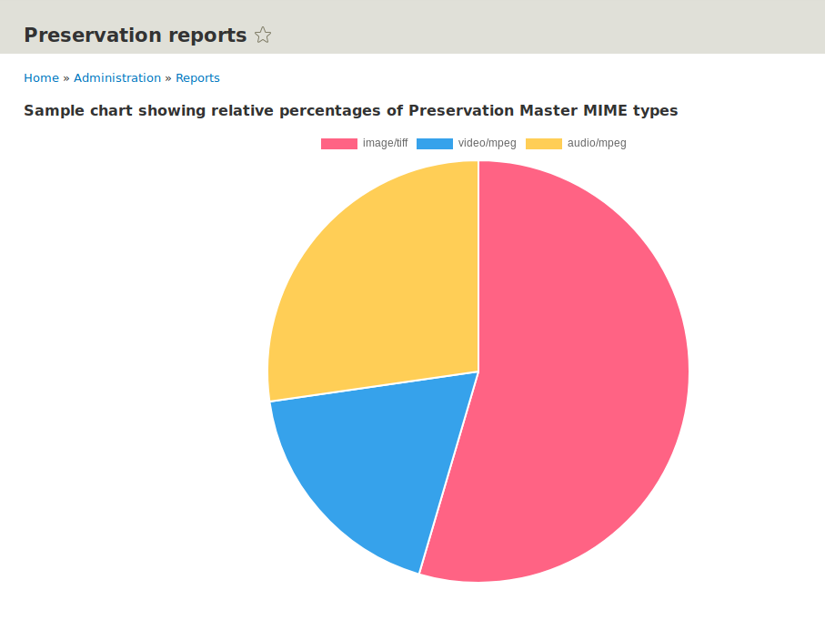
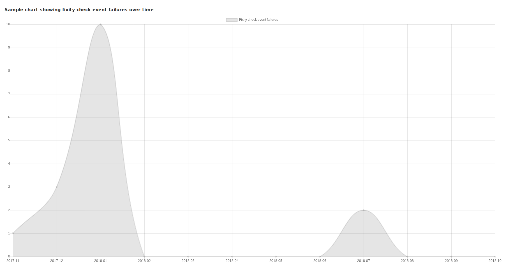

# Preservation Reports

## Introduction

Beginnings of a Drupal 8 module to provide reports relevant to preservation of resources managed by Islandora.

## Overview

Currently doesn't do anything other than display a couple of sample charts at "Admin > Reports > Preservation reports" generated from dummy data, a pie chart containing dummy data showing relative numbers of Preservation Masters with 'image/tiff', 'video/mpeg', 'audio/mpeg' MIME types:

and a sample line chart showing fixity check event failures over the last year:

Intended functionality is to get this data (and other types of "preservation" data) from Solr, which implies that the data must be indexed in Solr.

## Requirements

* [Islandora](https://github.com/Islandora-CLAW/islandora) a.k.a. CLAW

Uses the [Chart.js Javascript library](http://www.chartjs.org/) for now. Chart.js is not a local requirement, since it is called from a CDN. We should probably use the [Charts](https://www.drupal.org/project/charts) contrib module once it moves out of beta for Drupal 8.

## Installation

1. Clone this repo into your Islandora's `drupal/web/modules/contrib` directory.
1. Enable the module either under the "Admin > Extend" menu or by running `drush en -y preservation_reports`.

## Current maintainer:

* [Mark Jordan](https://github.com/mjordan)

## License

[GPLv2](http://www.gnu.org/licenses/gpl-2.0.txt)
